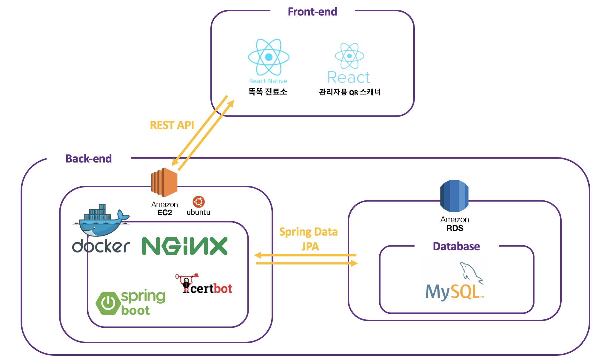
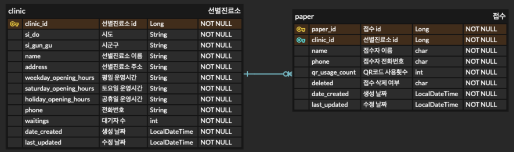
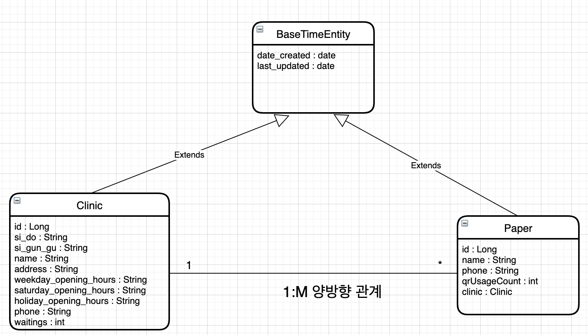
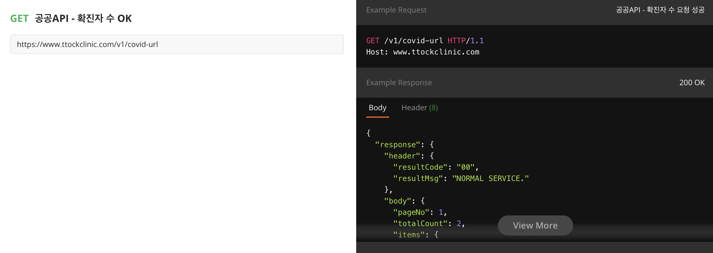
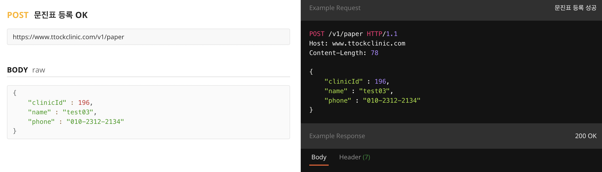
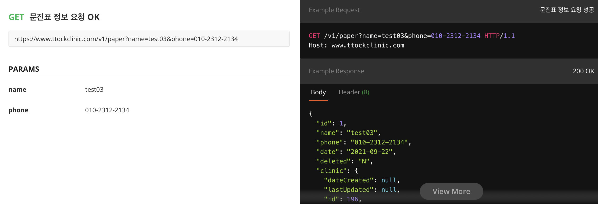
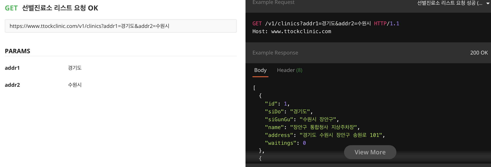
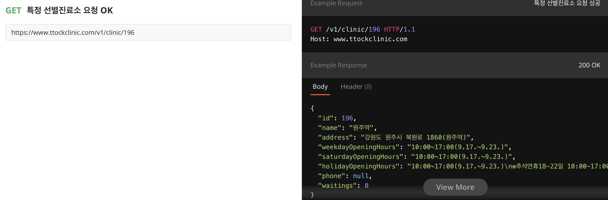

## 똑똑진료소 서버

### 주요 라이브러리 버전

Gradle, SpringBoot 2.5.3, Java 11 

 

### 프로젝트 코드 구조

- src/main/
  - java/com/ewhaenonymous/ttockclinic
    - controller : HTTP 요청
    - domain : Entity(선별진료소, 문진표)
    - exception : 예외처리
    - payload : 요청, 응답을 위한 DTO
    - repository : 데이터베이스 접근
    - service : 비즈니스 로직
    - Scheduler : 하루 지났을 때 문진표 삭제를 위한 Scheduling
  - resources 
    - application.yml : 공통 설정
    - application-dev.yml : 개발 시 설정
    - applicataion-real.yml : 배포 시 설정

- data/nginx/conf.d : nginx 설정
- Dockerfile : Spring Boot Docker image 생성을 위한 파일
- docker-compose.yml : App, Nginx, Certbot Container 생성
- init-letsencrypt.sh : 도메인 SSL 인증을 위한 스크립트
          
---

### 시스템 아키텍쳐

---

### Database 및 도메인 설계

---

### API Docs

[Postman-ttockclinic](https://documenter.getpostman.com/view/12950398/UUxtFWEm)

